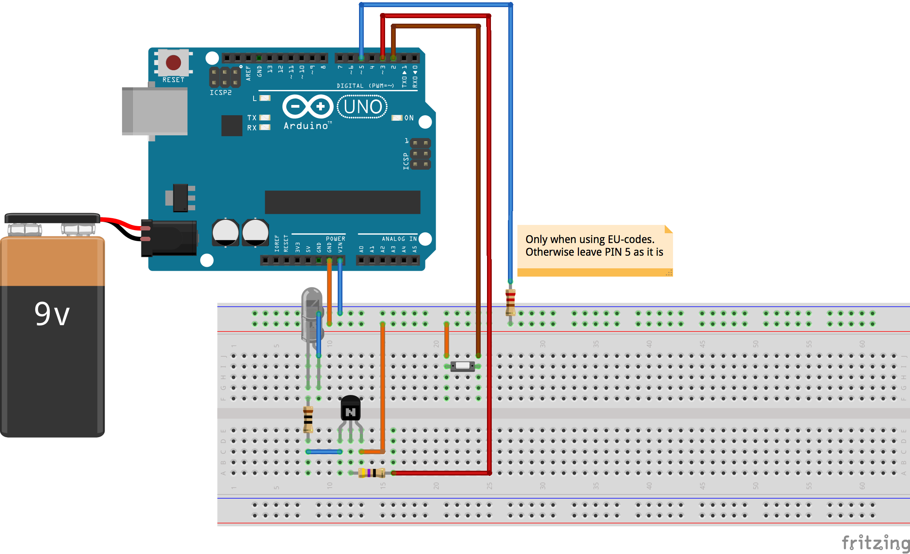

# TV-B-Gone with Arduino

Original repo can be [found here][original] and the corresponding Blog-Post (the most current one) can be [found here][blog] for further readings.
Unfortunately, both were not very clear about the wiring and during research I stumbled upon the corresponding [video-presentation][video] which made things much clearer (specifically the fact that the schematic diagram used in the blog post only shows haft the truth).

So finally, I got this thing up and running. Just upload the contained code and wire your Arduino up like this:

[original]:https://github.com/shirriff/Arduino-TV-B-Gone
[blog]:http://www.righto.com/2010/11/improved-arduino-tv-b-gone.html
[video]:https://www.youtube.com/watch?v=7_eTk-PSOIE&t=200s

