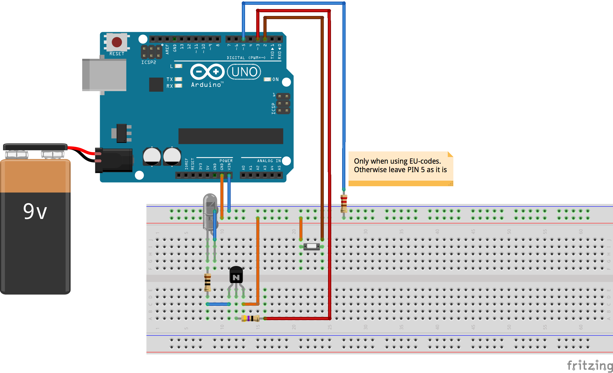
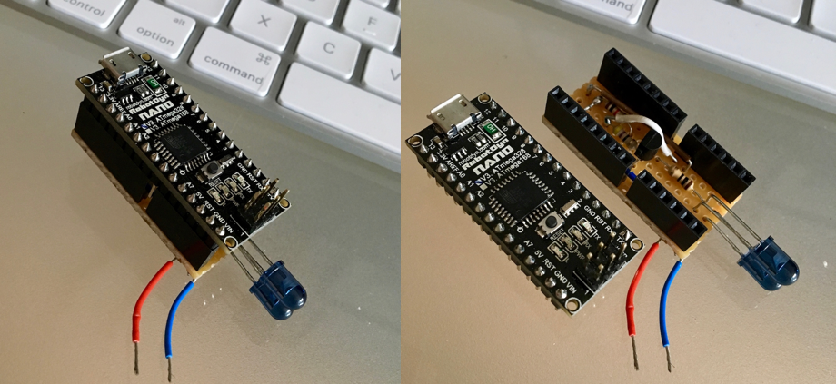

# TV-B-Gone with Arduino

Original repo can be [found here][original] and the corresponding Blog-Post (the most current one) can be [found here][blog] for further readings.
Unfortunately, both were not very clear about the wiring and during research I stumbled upon the corresponding [video-presentation][video] which made things much clearer (specifically the fact that the schematic diagram used in the blog post only shows half the truth).

So finally, I got this thing up and running. Just upload the contained code and wire your Arduino up like this (for EU-codes - for US-codes don't connect `PIN5`):

Provide a 9V power source and connect the both IR-diodes directly to `VIN`. 

### Reduce size with Ardunio Nano v3

In order to free my Arduino Uno (for further tinkering) and to reduce the size of the device I managed to upload the sketch to an [Arduino Nano v3][nano]. I replaced the breadboard with a soldered perfboard to get rid of loose jumper wires, further reduce size and mount it directly on the arduino. Here's the final result:

Connected to a 9V-Battery block (hence the 2 loose wires) this device is quite handy.

[original]:https://github.com/shirriff/Arduino-TV-B-Gone
[blog]:http://www.righto.com/2010/11/improved-arduino-tv-b-gone.html
[video]:https://www.youtube.com/watch?v=7_eTk-PSOIE&t=200s
[nano]:http://robotdyn.com/catalog/boards/nano_v3_ch340g_compatible_with_arduino_nano_v3/
